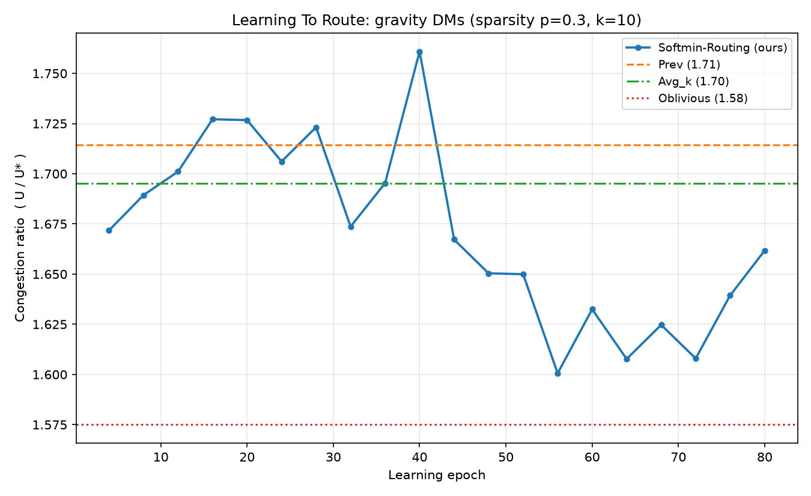
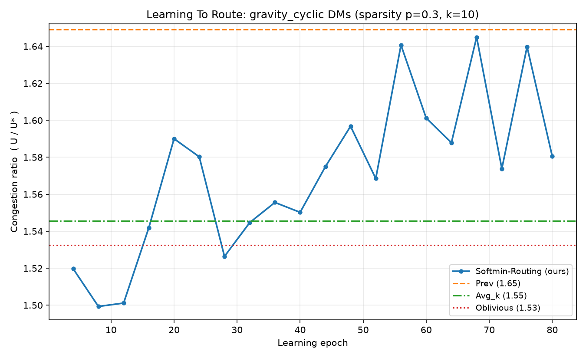
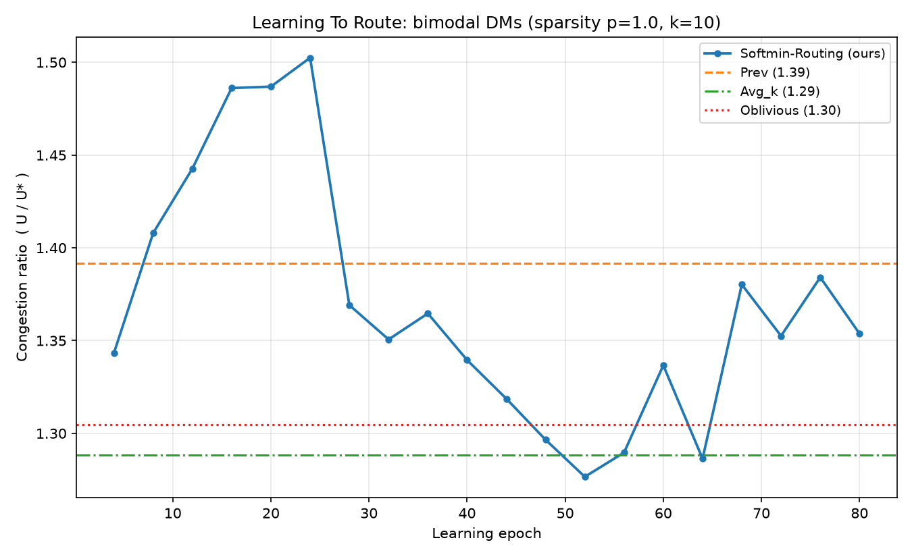
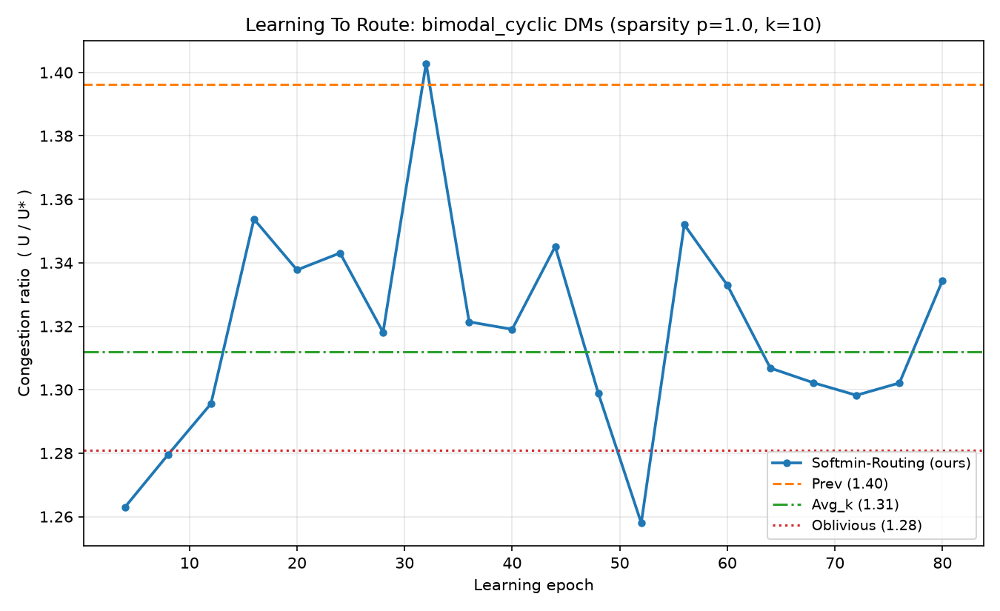

# LearnedRouting — Deep RL for Intradomain Traffic Engineering

From-scratch reproduction of **"Learning To Route"** (Valadarsky, Shahaf,
Schapira, Tamar — ACM HotNets 2017): an AI agent that learns how to route
traffic through a computer network, trained with deep reinforcement learning
and benchmarked against classical traffic-engineering methods.

Built as a cross-course project for **AI + Computer Networks + Data Structures
& Algorithms** (5th semester, FAST NUCES Peshawar). Every design decision is
traceable back to the paper — see `docs/PAPER_ANALYSIS.md` and
`docs/ARCHITECTURE.md`.

---

## 1. What Is This?

### The problem

Inside a single organization's network (an "intradomain" network), routers
forward packets hop-by-hop. Each router only sees a packet's destination and
forwards it to a neighbor according to **link weights** configured by the
network operator. Bad weights → some links overflow (congestion) while others
sit idle.

The catch: **you must pick the weights before you see tomorrow's traffic.**
You only know the history of past *demand matrices* (DMs) — n×n tables saying
how much traffic goes from every node to every node.

We measure success by **max-link-utilization**:

```
U = max over links e of  (traffic on e) / (capacity of e)
```

and compare against `U*` = the best any routing could possibly do for that
demand (computed exactly by a linear program). The ratio `U/U*` ≥ 1; closer
to 1 = better routing.

### The method (paper §4–§5)

At every time step the agent sees the last k=10 demand matrices and outputs
one weight per link. Weights become forwarding rules through **softmin**:

```
SP_w(u,v,d)   = w(u,v) + shortest-path distance v→d using w as lengths
R_{u,d}(v)    = exp(-γ·SP_w(u,v,d)) / Σ_{v'} exp(-γ·SP_w(u,v',d))     γ = 2
```

so each router splits traffic across neighbors, exponentially favoring the
shortest path — but hedging, which is exactly what makes congestion tunable.

Key trick from the paper: learn **|E| weights**, not |V|²×|E| splitting
ratios — a massive output-space compression that makes learning feasible.

- **State**: k recent DMs, log-transformed, flattened → vector of size k·n²
- **Action**: |E| real numbers → positive weights via `exp(·)`
- **Reward**: `-U/U*` after the true demand is revealed
- **Algorithm**: PPO (clipped surrogate objective + GAE); the paper used
  TRPO — substitution rationale below.

### Baselines it must beat

| Baseline | Meaning |
|---|---|
| **Prev** | re-optimize weights using only the most recent DM (reactive) |
| **Avg_k** | optimize against the mean of the k most recent DMs |
| **Oblivious** | one fixed strategy robust to *any* traffic (LP-based, strongest classical method) |

---

## 2. Results

12-node/34-edge topology · k=10 · γ=2 · PPO 80 epochs · exact-LP normalized
ratio on held-out test windows (mean U/U*, lower is better):

| Traffic family            | Agent | Prev  | Avg_k | Oblivious |
|---------------------------|-------|-------|-------|-----------|
| Gravity, iid, p=0.3       | **1.662** | 1.714 | 1.695 | 1.575 |
| Gravity, cyclic q=6       | **1.580** | 1.649 | 1.546 | 1.533 |
| Bimodal 40%, iid          | **1.354** | 1.392 | 1.288 | 1.305 |
| Bimodal 40%, cyclic q=6   | **1.334** | 1.396 | 1.312 | 1.281 |

**The learned policy beats Prev in all four regimes** — reproducing the
paper's central claim. On unpredictable (iid) traffic no history-method can
beat a static robust one in principle, so landing between Prev and
Oblivious is the theoretically expected sweet spot; on cyclic traffic the
gap to the static baselines narrows further.

### Pictures

Figure-2-style comparison (learning curves vs baselines):


Per-regime plots:

| Gravity (iid p=0.3) | Gravity (cyclic q=6) |
|---|---|
|  |  |

| Bimodal 40% (iid) | Bimodal 40% (cyclic q=6) |
|---|---|
|  |  |

Reading the plots: x-axis = learning epochs; blue curve = our agent
(improves over time); dashed/dotted horizontal lines = non-learning
baselines (constant by definition). Y-axis = congestion ratio U/U*.

---

## 3. How It Was Made

Built incrementally, one module per step, each proven correct **before**
building the next thing on top of it:

```
Phase 0  read the paper → docs/PAPER_ANALYSIS.md
Phase 1  design modules → docs/ARCHITECTURE.md
Phase 2  graph → traffic → routing → baselines → agent → train → eval
         (each module ships with its own sanity-test script)
Phase 3  train on 4 traffic regimes → plots + README (this file)
```

Module-by-module, with what each had to prove before moving on:

| Step | Module | Had to demonstrate standalone |
|---|---|---|
| 1 | `graph/` | Dijkstra matches hand-computed distances on known graphs; topology fully connected; edge↔index mapping consistent |
| 2 | `traffic/` | gravity model deterministic; bimodal has exactly two demand levels with 10× ratio and correct elephant fraction; sparsify keeps ~p share of pairs; cyclic sequences repeat with exact period |
| 3 | `routing/` | softmin ratios sum to 1 per neighbor-set and zero elsewhere; γ→∞ recovers shortest-path routing; line graph carries exactly 10 units along 3 edges; symmetric diamond splits 50/50; weighted diamond tilts to the analytically predicted e⁻⁴/(e⁻⁴+e⁻⁶) split |
| 4 | `baselines/` | Prev recovers the *exact* optimum on a symmetric diamond; Avg_k consistent with Prev on stationary history; Oblivious achieves ratio 1.000 on its own scenarios |
| 5 | `agent/` | GAE returns match hand-computed discounted sums; PPO update shifts the policy toward rewarded actions in a synthetic bandit |
| 6 | `train/` | end-to-end mini-run finishes with finite metrics, saved artifacts, baseline caching works |
| 7 | `eval/` | extracts curves from `metrics.json`, renders Figure-2-style panels |

### Bugs the tests caught (the part tutorials never show you)

These were real failures discovered *because* each module carried proofs:

1. **OPT linear program** — capacity rows were written per-commodity instead
   of per-edge aggregates. Single-commodity toy cases passed perfectly while
   real cases returned an "optimum" *below a provable cut lower bound*.
   Fixed by building the constraint matrix as E aggregated rows.
2. **Dijkstra dtype bug** — distances stored as float32 while relaxations
   pushed float64 values; when float32 rounded down, the stale-entry guard
   fired on a node's *first legitimate visit* and silently skipped expanding
   it, manufacturing unreachable nodes. Fix: float64 throughout.
3. **NumPy broadcasting misalignment** — a `(u,d)` selection mask inside
   `np.where` broadcast against `(u,v,d)` ratio tensors, aligning its axes to
   the wrong dimensions and inverting splitting ratios. One-character-class
   fix (`has_mass[:, None, :]`).
4. **Transpose bug in flow propagation** — traffic was initialized
   source-major where the propagator expected destination-major; nothing
   ever moved until delivered-fraction assertions failed.
5. **Sign bug in the LP incidence matrix** — supply convention contradicted
   the inflow/outflow encoding, making trivially feasible problems
   "infeasible".

Each failure produced a new permanent regression test.

---

## 4. Setup (from scratch)

Requires Python ≥ 3.11. From the project root:

```bash
cd ~/LearnedRouting

python -m venv .venv
.venv/bin/pip install --upgrade pip
.venv/bin/pip install -r requirements.txt      # numpy scipy matplotlib torch(CPU)
```

> On Arch/Fedora with system-managed Python (PEP 668) always use the venv —
> plain `pip install` will refuse. All commands below call `.venv/bin/python`
> directly so the environment activates implicitly.

---

## 5. Verify (run the test suites)

Every module has a self-contained proof script. Run all six:

```bash
PYTHONPATH=. .venv/bin/python graph/test_graph.py
PYTHONPATH=. .venv/bin/python traffic/test_traffic.py
PYTHONPATH=. .venv/bin/python routing/test_routing.py
PYTHONPATH=. .venv/bin/python baselines/test_baselines.py
PYTHONPATH=. .venv/bin/python agent/test_agent.py
PYTHONPATH=. .venv/bin/python train/test_train.py
```

Expected final line of each: `=== ALL ... TESTS PASSED ===`.
(`baselines` takes ~30–60 s because Powell weight optimization is genuinely
being exercised; everything else is seconds.)

---

## 6. Train & Reproduce the Plots

Quick smoke run (~30 s/config, proves the pipeline end-to-end):

```bash
.venv/bin/python -u main.py --configs gravity --epochs 20 --eval-every 5 --outroot results_smoke
```

Full reproduction — all four regimes (~10 min total on CPU):

```bash
.venv/bin/python -u main.py \
    --configs gravity gravity_cyclic bimodal bimodal_cyclic \
    --epochs 80 --eval-every 4
```

Single regime of your choice:

```bash
.venv/bin/python -u main.py --configs bimodal_cyclic --epochs 120
```

All CLI flags:

| Flag | Default | Meaning |
|---|---|---|
| `--configs` | `gravity` | any of: `gravity`, `bimodal`, `gravity_cyclic`, `bimodal_cyclic` |
| `--epochs` | 60 | learning epochs (each = full pass over 7×30 training windows) |
| `--eval-every` | 5 | evaluate agent + report every N epochs |
| `--seq-len` | 40 | demand matrices per sequence |
| `--reward-normalizer` | `lp` | `lp` = exact optimum (cached); `bound` = instant cut-bound approximation |
| `--seed` | 42 | RNG seed (change to test robustness) |
| `--outroot` | `results` | output directory root |

Live console output looks like:

```
[epoch  80] train_reward=-1.4567 agent_U/U*=1.354 prev=1.392 avgk=1.288 obliv=1.305 (155s)
```

---

## 7. Outputs Explained

```
results/seed42/
├── congestion_ratio_combined.png    ← Figure-2 style panel per regime (headline plot)
├── summary.json                     ← final numbers + wall-clock per config
├── gravity/
│   ├── metrics.json                 ← config echo + full per-epoch learning curve
│   ├── checkpoint.pt                ← trained policy + optimizer state + demand_scale
│   └── congestion_ratio.png         ← single-regime comparison plot
├── bimodal/  gravity_cyclic/  bimodal_cyclic/   (same layout)
```

Verification checklist: agent's final `test_agent_ratio_mean` should be below
`final_prev_ratio_mean` in every config, and match the table in §2 within
noise (±0.05).

---

## 8. Paper Mapping

| Paper section / concept | Code |
|---|---|
| §2 Network model G=(V,E,c), capacities | `graph/network.py` (`NetworkGraph`) |
| §2 Routing strategy R_{v,(s,t)}, induced flows | `routing/softmin.py` (`FlowPropagator.propagate`) |
| §2 Objective max-link-utilization | `routing/softmin.py` (`max_link_utilization`) |
| §3.1 Gravity & bimodal DM generation, sparsification | `traffic/generator.py` |
| §3.1 DM sequence classes (cyclic / iid / averaged) | `traffic/generator.py`, `train/trainer.py` (`_make_sequences`) |
| §4 RL formulation: state = k-DM history | `train/trainer.py` (`_state_of`) |
| §4 Reward r = −U/OPT | `train/trainer.py` (`reward_for_weights`) + `routing/optimal.py` (exact LP) |
| §5 Softmin routing, SP_w(u,v,d), γ=2 | `routing/softmin.py` (`softmin_splitting_ratios`) |
| §5 Output compression: learn \|E\| weights not ratios | `agent/ppo.py` (action head dim = \|E\|) |
| §5 Baseline Prev | `baselines/classical.py` (`PrevBaseline`) |
| §5 Baseline Avg_k | `baselines/classical.py` (`AvgKBaseline`) |
| §5 Baseline Oblivious [Azar et al.] | `baselines/classical.py` (`ObliviousRouting`) |
| §5 Training loop (windows, learning epochs) | `train/trainer.py` (`train_epoch`, `run`) |
| §5 Fig. 2 evaluation | `eval/evaluate.py`, `eval/plot.py` |
| TRPO mechanics (replaced — see §10) | `agent/ppo.py` (PPO + GAE) |

## 9. Course-Concept Mapping

| Course | Where it lives |
|---|---|
| **DSA** | binary-heap Dijkstra, adjacency-list representation, sparse COO constraint matrices, sliding-window state tensors, complexity analysis O((V+E) log V) |
| **Computer Networks** | capacities & utilization, destination-based hop-by-hop forwarding, TE objectives, OSPF-style weight optimization (Fortz–Thorup local search inside `SoftminWeightOptimizer`), reactive/averaged/oblivious TE baselines, gravity & bimodal traffic models |
| **AI** | PPO clipped-surrogate objective, GAE advantage estimation, actor-critic architecture, entropy regularization, Gaussian exploration policies, reward normalization via LP |

## 10. Deviations from the Paper (and why)

1. **PPO instead of TRPO.** TRPO needs conjugate gradients, line search and
   Hessian-vector products — heavy and fragile to hand-roll. PPO is its direct
   successor, preserving the trust-region idea via clipping. The paper's actual
   contribution (state/action/reward design + softmin output compression) is
   unchanged. The Nature-DQN machinery (experience replay, target networks)
   solves off-policy instability that does not arise in PPO's on-policy buffer.
2. **Reward normalizer.** Exact U* comes from a HiGHS LP (~15 ms/DM, cached by
   matrix bytes); cut-based lower bound available as instant fallback.
3. **Avg_k interpretation.** Implemented as optimizing softmin weights against
   the element-wise mean of the k recent DMs, evaluated on the upcoming DM.
4. **Oblivious approximation.** Azar et al.'s optimal oblivious routing covers
   *all* possible demands; we solve the same competitive-ratio LP restricted to
   a sampled scenario family from the deployment traffic model (6 scenarios).
   It achieves ratio ≈ 1.00 on its own scenarios; the generalization gap is
   reported honestly in §2.
5. **Demand rescaling.** Each DM is scaled so its cut lower bound hits target
   utilization 0.5 — a global positive scaling that provably changes no routing
   decision, only keeps magnitudes readable.
6. **Shared bandwidth profile.** Node ingress/egress bandwidths are drawn once
   per experiment and shared across train/test/scenario generators — they are
   properties of the network, not per-epoch randomness.
7. **Topology.** The paper uses a 12-node/32-edge Topology Zoo network; we use
   a comparable fully-connected 12-node/34-edge graph
   (`graph/network.py::create_12_node_topology`).

## 11. Repository Layout

```
docs/        PAPER_ANALYSIS.md + ARCHITECTURE.md (design & derivations)
graph/       NetworkGraph, heap Dijkstra, 12-node topology   (+ test_graph.py)
traffic/     gravity/bimodal DMs, sparsification, sequences  (+ test_traffic.py)
routing/     softmin ratios, flow propagation, OPT LP        (+ test_routing.py)
baselines/   Prev, Avg_k, Oblivious                          (+ test_baselines.py)
agent/       PPO actor-critic, GAE rollout buffer            (+ test_agent.py)
train/       environment loop, reward, metrics               (+ test_train.py)
eval/        curve extraction, Figure-2 plotting
main.py      end-to-end CLI runner
results/     trained artifacts, metrics, plots
Papers/      source PDFs (Learning To Route + DQN references)
```
