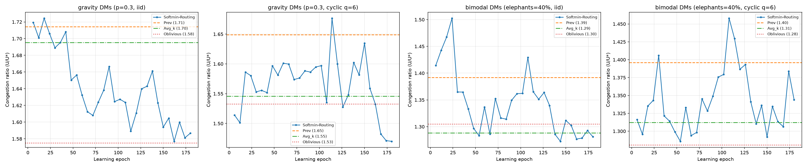
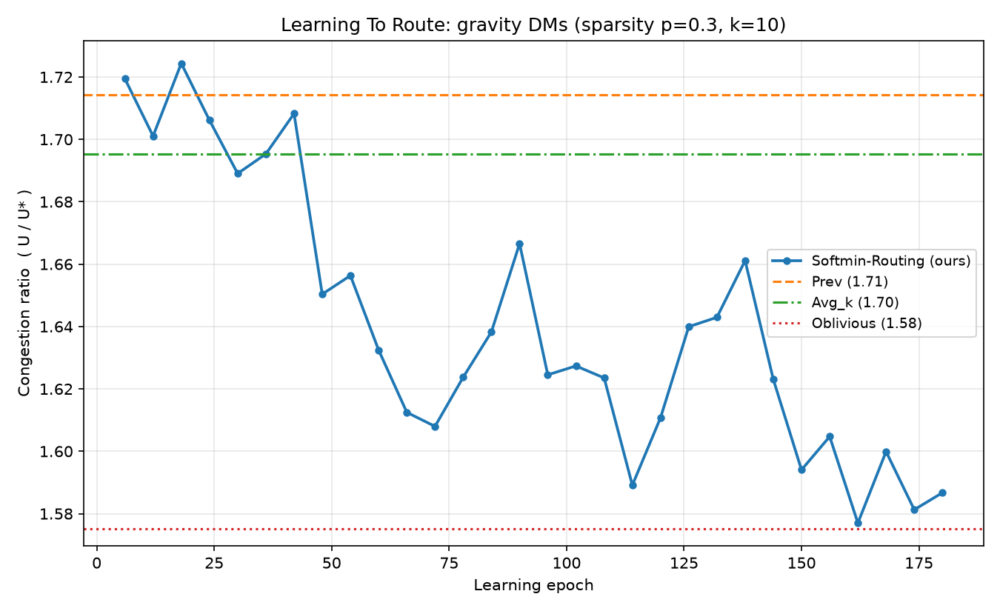
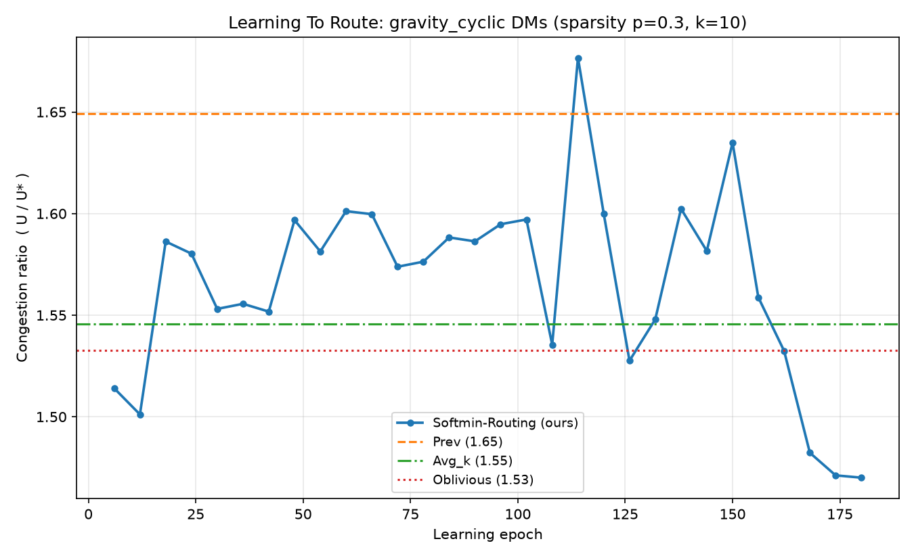
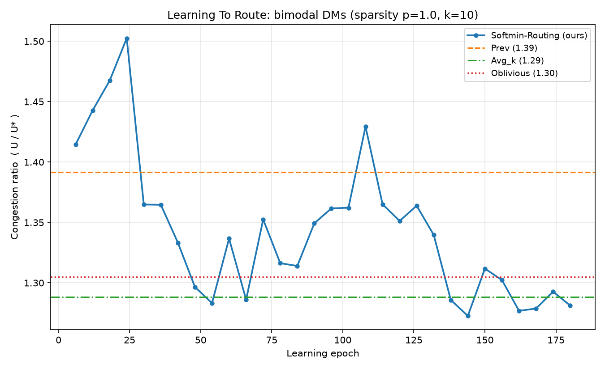
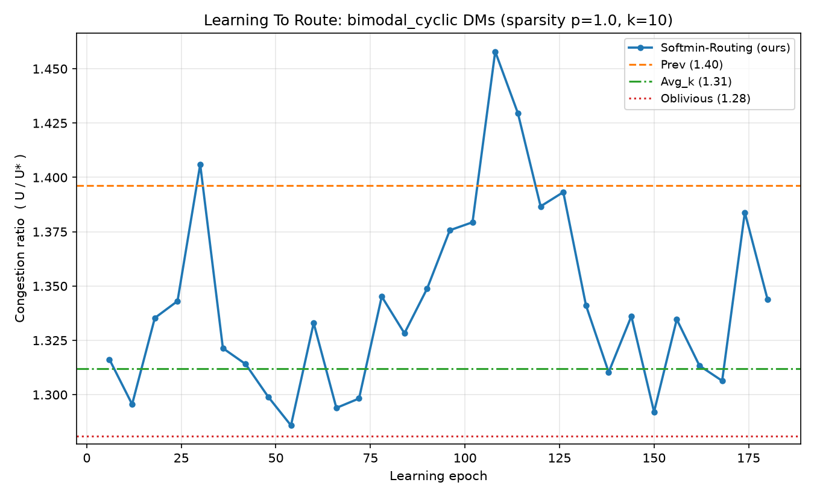
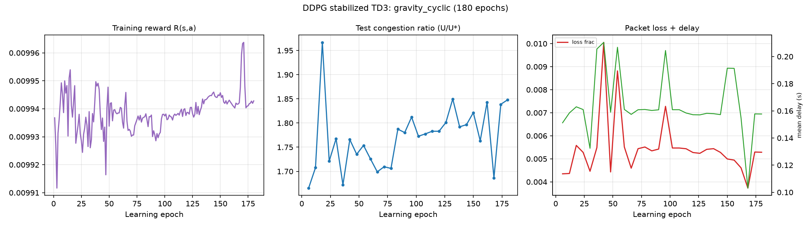
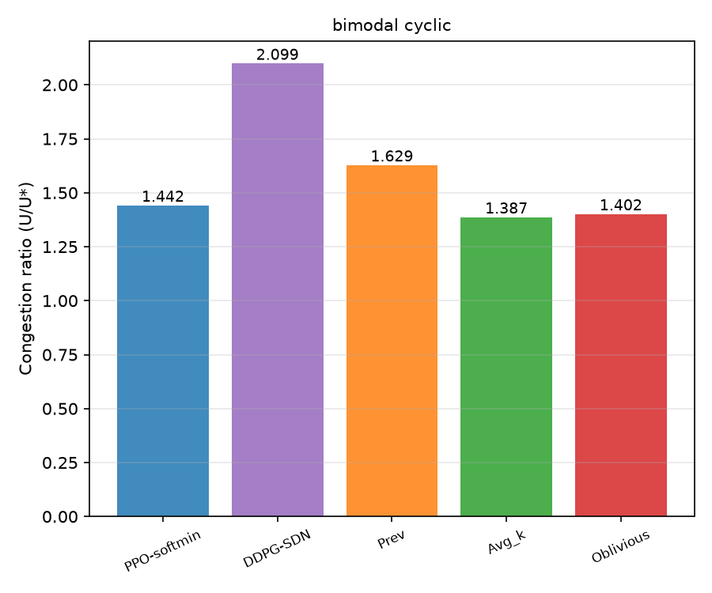
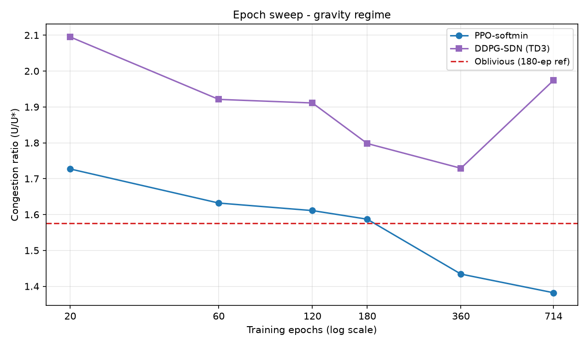

# Deep Learning Traffic Engineering - Deep RL for Intradomain Traffic Engineering

Two research papers implemented from scratch in one repo, solving the same
problem - learning link weights that route traffic well - with different RL
algorithms and different performance models, then compared against each other
and three classical baselines on identical traffic:

1. **"Learning To Route"** (Valadarsky, Shahaf, Schapira, Tamar - ACM
   HotNets 2017): PPO agent, softmin multipath splitting, congestion-ratio
   reward `−U/U*` (LP-normalized).
2. **"Deep RL-Based Routing on Software-Defined Networks"** (Kim, Kim, Lim -
   IEEE Access 2022): DDPG agent, single-path SDN shortest-path forwarding,
   M/M/1/K queueing reward over end-to-end delay + packet loss.

Built as a cross-course project for **AI + Computer Networks + Data Structures
& Algorithms.** Every design decision is
traceable back to its paper - see `docs/` for both papers' analyses
and architecture documents.

---

## 1. What Is This?

### The problem

Inside a single organization's network (an "intradomain" network), routers
forward packets hop-by-hop. Each router only sees a packet's destination and
forwards it to a neighbor according to **link weights** configured by the
network operator. Bad weights → some links overflow (congestion) while others
sit idle.

The catch: **you must pick the weights before you see tomorrow's traffic.**
You only know the history of past *demand matrices* (DMs) - n×n tables saying
how much traffic goes from every node to every node.

We measure success by **max-link-utilization**:

```
U = max over links e of  (traffic on e) / (capacity of e)
```

and compare against `U*` = the best any routing could possibly do for that
demand (computed exactly by a linear program). The ratio `U/U*` ≥ 1; closer
to 1 = better routing.

### The method (paper §4-§5)

At every time step the agent sees the last k=10 demand matrices and outputs
one weight per link. Weights become forwarding rules through **softmin**:

```
SP_w(u,v,d)   = w(u,v) + shortest-path distance v→d using w as lengths
R_{u,d}(v)    = exp(-γ·SP_w(u,v,d)) / Σ_{v'} exp(-γ·SP_w(u,v',d))     γ = 2
```

so each router splits traffic across neighbors, exponentially favoring the
shortest path - but hedging, which is exactly what makes congestion tunable.

Key trick from the paper: learn **|E| weights**, not |V|²×|E| splitting
ratios - a massive output-space compression that makes learning feasible.

- **State**: k recent DMs, log-transformed, flattened → vector of size k·n²
- **Action**: |E| real numbers → positive weights via `exp(·)`
- **Reward**: `-U/U*` after the true demand is revealed
- **Algorithm**: PPO (clipped surrogate objective + GAE); the paper used
  TRPO - substitution rationale below.

### Baselines it must beat

| Baseline | Meaning |
|---|---|
| **Prev** | re-optimize weights using only the most recent DM (reactive) |
| **Avg_k** | optimize against the mean of the k most recent DMs |
| **Oblivious** | one fixed strategy robust to *any* traffic (LP-based, strongest classical method) |

---

## 2. Results

12-node/34-edge topology · k=10 · γ=2 · PPO 80 epochs · exact-LP normalized
ratio on held-out test windows (mean U/U*, lower is better):

Both methods here are trained 180 epochs (see §7c/§7d for what epochs
change). Values = each run's own final evaluation over ALL test windows
(this matches the embedded per-regime figures below); §7b uses the
stride-2 five-method protocol, so its numbers differ slightly on cyclic
regimes - both are raw, neither is hand-adjusted:

| Traffic family            | Agent | Prev  | Avg_k | Oblivious |
|---------------------------|-------|-------|-------|-----------|
| Gravity, iid, p=0.3       | **1.587** | 1.706 | 1.753 | 1.575 |
| Gravity, cyclic q=6       | **1.470** | 1.654 | 1.546 | 1.533 |
| Bimodal 40%, iid          | **1.281** | 1.471 | 1.288 | 1.305 |
| Bimodal 40%, cyclic q=6   | **1.344** | 1.396 | 1.312 | 1.281 |

**The learned policy beats Prev in all four regimes** - reproducing the
paper's central claim. On unpredictable (iid) traffic no history-method can
beat a static robust one in principle, so landing between Prev and
Oblivious is the theoretically expected sweet spot; on cyclic traffic the
gap to the static baselines narrows further.

### Pictures

Figure-2-style comparison (learning curves vs baselines):



Per-regime plots:

| Gravity (iid p=0.3) | Gravity (cyclic q=6) |
|---|---|
|  |  |

| Bimodal 40% (iid) | Bimodal 40% (cyclic q=6) |
|---|---|
|  |  |

Reading the plots: x-axis = learning epochs; blue curve = our agent
(improves over time); dashed/dotted horizontal lines = non-learning
baselines (constant by definition). Y-axis = congestion ratio U/U*.

---

## 3. How It Was Made

Built incrementally, one module per step, each proven correct **before**
building the next thing on top of it - separately for each paper, against
shared foundations.

```
Paper 1 (Learning-To-Route)
  Phase 0  read the paper -> docs/PAPER_ANALYSIS_LEARNING_TO_ROUTE.md
  Phase 1  design modules -> docs/ARCHITECTURE_LEARNING_TO_ROUTE.md
  Phase 2  graph -> traffic -> softmin_routing -> baselines -> agent
           -> train -> eval   (each ships its own sanity-test script)
  Phase 3  train on 4 traffic regimes -> plots + README

Paper 2 (SDN-DDPG)
  Phase 0  read the paper -> docs/PAPER_ANALYSIS_SDN_DDPG.md
  Phase 1  design modules -> docs/ARCHITECTURE_SDN_DDPG.md
  Phase 2  queue_model -> reward -> forwarding -> agent -> environment
           -> train -> comparison
  Phase 3  train all 4 regimes -> five-method comparison vs Paper 1
           + classical baselines -> README
```

### Paper 1 - what each module had to prove standalone

| Step | Module | Had to demonstrate |
|---|---|---|
| 1 | `graph/` | Dijkstra matches hand-computed distances on known graphs; topology fully connected; edge-index mapping consistent |
| 2 | `traffic/` | gravity model deterministic; bimodal has exactly two demand levels with 10x ratio and correct elephant fraction; sparsify keeps ~p share of pairs; cyclic sequences repeat with exact period |
| 3 | `softmin_routing/` | ratios sum to 1 per neighbor-set and zero elsewhere; gamma->infinity recovers shortest-path routing; line graph carries exactly 10 units along 3 edges; symmetric diamond splits 50/50; weighted diamond tilts to the analytically predicted split |
| 4 | `baselines/` | Prev recovers the exact optimum on a symmetric diamond; Avg_k consistent with Prev on stationary history; Oblivious achieves ratio 1.000 on its own scenarios |
| 5 | `agent/` | GAE returns match hand-computed discounted sums; PPO update shifts the policy toward rewarded actions in a synthetic bandit |
| 6 | `train/` | end-to-end mini-run finishes with finite metrics, saved artifacts, baseline caching works |
| 7 | `eval/` | extracts curves from `metrics.json`, renders Figure-2-style panels |

### Paper 2 - what each module had to prove standalone

| Step | Module | Had to demonstrate |
|---|---|---|
| 1 | `queue_model/` | Eqs.(1)-(3) match a hand-worked toy switch (rho=0.5, K=4 gives Pb=1/31, E[N]=26/31, E[d]=26/15); rho=0 and rho=1 branches; monotone loss; finite at paper scale (K=10000) |
| 2 | `reward/` | rewards bounded in [0,1] under random stress; zero-traffic and saturation clamps; alpha interpolation endpoints |
| 3 | `forwarding/` | reconstructed paths cost exactly what Dijkstra says (random weights, 150 flows); ATVM mass conservation on a line graph; upstream loss shrinks downstream rates; uniform weights reproduce hop-count routing |
| 4 | `agent/` | actor output confined to [w_min,w_max]; target soft-update arithmetic exact at tau=1, 0.25, 0; OU noise reproducible after reset and mean-reverting; ring-buffer eviction; synthetic-bandit convergence |
| 5 | `environment/` | finite step outputs; uniform weights give hop-count paths; loss monotone in offered load; state depends on previous action |
| 6 | `train/` | rate calibration lands hotspot rho at 0.90; mini-run finite with artifacts; deterministic evaluation repeatable |
| 7 | `comparison/` | rebuilds bit-identical test streams for both methods (asserted), stamps stride+variant, refuses mismatched reruns |

### Bugs the tests caught

Paper 1:

1. **OPT linear program** - capacity rows were written per-commodity instead
   of per-edge aggregates. Single-commodity toy cases passed perfectly while
   real cases returned an "optimum" below a provable cut lower bound.
2. **Dijkstra dtype bug** - float32 distance storage plus float64
   relaxations let the stale-entry guard fire on a node's first legitimate
   visit, silently manufacturing unreachable nodes. Fix: float64 throughout.
3. **NumPy broadcasting misalignment** - a (u,d) mask inside np.where
   broadcast against (u,v,d) tensors along the wrong axis, inverting
   splitting ratios. Fix: restore the missing axis.
4. **Transpose bug in flow propagation** - traffic initialized source-major
   where the propagator expected destination-major; nothing moved until
   delivered-fraction assertions failed.
5. **Sign bug in the LP incidence matrix** - supply convention contradicted
   the inflow/outflow encoding, making feasible problems "infeasible".

Paper 2:

1. **Shortest-path reconstruction concept error** - greedy next-hop descent
   on source-rooted distances walks back through predecessors and
   oscillates; correct descent needs distances TO the destination. Fixed by
   running Dijkstra on a reversed copy of the graph per unique destination
   - caught by path-cost-vs-Dijkstra assertions.
2. **M/M/1/K overflow form** - computing rho**K directly overflows for
   rho>1 and loses precision near rho=1; the stable form multiplies through
   by rho^-(K+1). Caught by the paper-scale (K=10000) test.
3. **Non-monotone delay physics** - a test asserted delay rises with
   offered load; M/M/1/K delay actually peaks near rho=1 (admitted
   throughput collapses) then falls as blocking sheds arrivals. The test
   was wrong, not the code - rewritten to document the real behavior.
4. **OU noise reset** - reset() restored the state vector but not the RNG
   cursor, so episodes were not reproducible. Caught by a reset-and-compare
   assertion.
5. **Silently dropped config fields** - DDPGConfig lacked
   sequence_mode/cyclic_q, so the "cyclic" DDPG runs quietly trained on
   iid traffic. Caught by the comparison harness's stream-identity
   assertion, then fixed and retrained.
6. **Output-path collision** - both trainers wrote to the same results
   directories; DDPG runs overwrote Paper-1 artifacts. Fixed with
   per-paper suffixes; the incident also produced the stride/variant
   stamping + refusal guard on comparison.json.

Paper 2 additionally required a training-stability investigation: plain
DDPG's critic loss diverges exponentially at any learning rate (full
evidence and the twin-critic + reward-scaling + gamma fix in §10b of
`docs/PAPER_ANALYSIS_SDN_DDPG.md` and §7c here). Every failure above
ended as a permanent regression test.

---

## 4. Setup (from scratch)

Requires Python ≥ 3.11. From the project root:

```bash
cd ~/Deep-Learning-Traffic-Engineering

python -m venv .venv
.venv/bin/pip install --upgrade pip
.venv/bin/pip install -r requirements.txt      # numpy scipy matplotlib torch(CPU)
```

> On Arch/Fedora with system-managed Python (PEP 668) always use the venv -
> plain `pip install` will refuse. All commands below call `.venv/bin/python`
> directly so the environment activates implicitly.

---

## 5. Verify (run the test suites)

Every module has a self-contained proof script. Run all:

```bash
export PYTHONPATH=".:Learning-To-Route:SDN-DDPG"

.venv/bin/python graph/test_graph.py                       # shared: topology + Dijkstra
.venv/bin/python traffic/test_traffic.py                   # shared: demand models
.venv/bin/python Learning-To-Route/softmin_routing/test_routing.py
.venv/bin/python Learning-To-Route/baselines/test_baselines.py
.venv/bin/python Learning-To-Route/agent/test_agent.py
.venv/bin/python Learning-To-Route/train/test_train.py
.venv/bin/python SDN-DDPG/sdn_ddpg/queue_model/test_delay_model.py
.venv/bin/python SDN-DDPG/sdn_ddpg/reward/test_reward.py
.venv/bin/python SDN-DDPG/sdn_ddpg/forwarding/test_routing_sdn.py
.venv/bin/python SDN-DDPG/sdn_ddpg/agent/test_ddpg.py
.venv/bin/python SDN-DDPG/sdn_ddpg/environment/test_environment.py
.venv/bin/python SDN-DDPG/sdn_ddpg/train/test_trainer.py
```

(`main.py` sets these paths itself, so training/compare commands need no
`PYTHONPATH`.)

Expected final line of each: `=== ALL ... TESTS PASSED ===`.
(`baselines` takes ~30-60 s because Powell weight optimization is genuinely
being exercised; everything else is seconds.)

---

## 6. Train & Reproduce the Plots

Both methods train on the same four traffic regimes. The DDPG method lives in
`sdn_ddpg/` and reuses the same `graph/` + `traffic/` streams, so every
comparison is genuinely apples-to-apples.

Quick smoke run (~30 s/config, proves the pipeline end-to-end):

```bash
.venv/bin/python -u main.py --configs gravity --epochs 20 --eval-every 5 --outroot results_smoke
```

Full reproduction - all four regimes (~10 min total on CPU):

```bash
.venv/bin/python -u main.py \
    --configs gravity gravity_cyclic bimodal bimodal_cyclic \
    --epochs 80 --eval-every 4
```

Second method (SDN-DDPG, Kim et al. 2022) - same four regimes:

```bash
.venv/bin/python -u main.py --method sdn-ddpg \
    --configs gravity gravity_cyclic bimodal bimodal_cyclic \
    --epochs 80 --eval-every 5
```

Five-method comparison (loads both checkpoints + re-evaluates Prev / Avg_k /
Oblivious on identical test streams, writes `comparison.json` and the joint
figures):

```bash
.venv/bin/python -u main.py --compare \
    --configs gravity gravity_cyclic bimodal bimodal_cyclic
```

Single regime of your choice:

```bash
.venv/bin/python -u main.py --configs bimodal_cyclic --epochs 120
.venv/bin/python -u main.py --method sdn-ddpg --configs bimodal_cyclic --epochs 120
```

All CLI flags:

| Flag | Default | Meaning |
|---|---|---|
| `--configs` | `gravity` | any of: `gravity`, `bimodal`, `gravity_cyclic`, `bimodal_cyclic` |
| `--epochs` | 60 | learning epochs (each = full pass over 7×30 training windows) |
| `--eval-every` | 5 | evaluate agent + report every N epochs |
| `--seq-len` | 40 | demand matrices per sequence |
| `--reward-normalizer` | `lp` | `lp` = exact optimum (cached); `bound` = instant cut-bound approximation |
| `--seed` | 42 | RNG seed (change to test robustness) |
| `--method` | `ppo` | which paper to train: `ppo` or `sdn-ddpg` |
| `--compare` | off | five-method evaluation mode (uses saved checkpoints) |
| `--stride` | 2 | window subsampling for `--compare` (1 = every window) |
| `--td3` | off | train/compare the stabilized DDPG variant (twin critics + target smoothing + reward scaling + gamma 0.9); writes `<config>_sdn_td3` |
| `--force` | off | allow `--compare` to overwrite a `comparison.json` entry stamped with a different stride/variant |
| `--outroot` | `results` | output directory root |

Live console output looks like:

```
[epoch  80] train_reward=-1.4567 agent_U/U*=1.354 prev=1.392 avgk=1.288 obliv=1.305 (155s)
```

---

## 7. Outputs Explained

```
results/seed42/
├── congestion_ratio_combined.png     ← Figure-2 panels, Paper-1 regimes
├── five_method_combined.png          ← five-method bars, all four regimes
├── five_method_<regime>.png          ← per-regime three-metric panels
├── comparison.json                   ← joint numbers incl. DDPG-native delay/loss
├── summary.json                      ← training summaries
├── <regime>_ltr/                     ← Paper 1 artifacts
│   ├── metrics.json                  ← config echo + full learning curve
│   ├── checkpoint.pt                 ← PPO policy + demand_scale
│   └── congestion_ratio.png
├── <regime>_sdn/                     ← Paper 2, paper-faithful DDPG
│   ├── metrics.json / checkpoint.pt
│   └── training_curves.png           ← reward, U/U*, delay+loss panels
├── <regime>_sdn_td3/                 ← stabilized variant (--td3), same contents
│   └── training_curves.png
├── epstudy/e<N>/seed42/              ← epoch-sweep runs (§7d): e20..e714
└── epstudy/epoch_sweep_curves.png    ← sweep trajectories, both methods
```
(`<regime>` ∈ gravity, gravity_cyclic, bimodal, bimodal_cyclic)
(`<regime>` ∈ gravity, gravity_cyclic, bimodal, bimodal_cyclic)

Verification checklist: agent's final `test_agent_ratio_mean` should be below
`final_prev_ratio_mean` in every config, and match the table in §2 within
noise (±0.05).

---

## 7b. Five-Method Comparison - Where Each Method Wins

Both trained methods plus the three classical baselines, evaluated on
bit-identical test streams through one common measurement stack
(congestion vs exact LP optimum; delay/loss via one shared M/M/1/K
projection at the SDN paper's operating point):

Both learned methods trained 180 epochs. The DDPG column uses the
stabilized variant (twin critics + target smoothing + reward scaling +
gamma 0.9, enabled by `--td3`); the paper-faithful plain DDPG diverges
(see `docs/PAPER_ANALYSIS_SDN_DDPG.md` §10b) and its numbers are preserved
in `comparison_paper_ddpg.json`. Comparison runs use stride 2; entries in
`comparison.json` carry `_stride` + `_ddpg_variant` stamps and mismatched
reruns are refused without `--force`.

| Regime | PPO-softmin | DDPG-SDN (TD3) | Prev | Avg_k | Oblivious |
|---|---|---|---|---|---|
| gravity iid p=0.3       | **1.591** | 1.830 | 1.706 | 1.753 | 1.575 |
| gravity cyclic q=6      | 1.620 | 2.012 | 1.839 | 1.660 | **1.560** |
| bimodal 40% iid         | 1.295 | 2.293 | 1.471 | **1.231** | 1.258 |
| bimodal 40% cyclic q=6  | 1.442 | 2.099 | 1.629 | **1.387** | 1.402 |



Plain-Diverged-DDPG reference (same protocol, unstable critic - DO NOT
trust as a converged method): gravity 2.040 | gravity_cyclic 2.129 |
bimodal 1.749 | bimodal_cyclic 1.646. Its per-run curves live in
`results/seed42/<regime>_sdn/`.



Per-regime panels: `five_method_gravity.png`, `five_method_gravity_cyclic.png`,
`five_method_bimodal.png`, `five_method_bimodal_cyclic.png` (each shows
U/U*, delay, loss bars). Raw numbers: `comparison.json` (includes the DDPG
agent's native path-aware delay/loss alongside the common projection).

Honest reading:

- On the **common congestion metric**, PPO-softmin beats Prev in every regime
  and lands beside Avg_k/Oblivious; multipath softmin splitting is a real
  structural advantage here.
- **DDPG-SDN trails on congestion by design**: it optimizes delay+loss, not
  U/U\*, and single-path forwarding cannot spread hotspots the way softmin
  can. Its *native* evaluator (loss-feedback modeled per path) reports
  sub-second delays and <1% loss - good on its own terms, but those wins do
  not transfer to worst-link congestion.
- **Classical baselines stay competitive**: Avg_k is the best method overall
  on both bimodal regimes; Oblivious leads both gravity regimes. Learned
  routing does not dominate classical TE on this 12-node topology - which is
  itself a defensible, evidence-backed conclusion.
- Delay/loss columns use one shared no-feedback projection for all five
  methods; the DDPG column additionally carries `delay_native_mean` /
  `loss_native_mean` from its own path-aware model (≈0.08-0.19 s, <1% loss),
  so readers see both views.
  so readers see both views.

### 7c. What Increasing Epochs Actually Does

Measured by retraining everything at 80 vs 180 epochs (same seeds):

| Regime | PPO @80 | PPO @180 | DDPG @80 | DDPG @180 |
|---|---|---|---|---|
| gravity iid       | 1.709 | 1.591 | 2.227 | 2.040 |
| gravity cyclic    | 1.722 | 1.620 | 1.761 | 2.129* |
| bimodal iid       | 1.349 | 1.295 | 1.800 | 1.749 |
| bimodal cyclic    | 1.415 | 1.442 | 1.746 | 1.646 |

(*DDPG gravity_cyclic got worse with more training - its queueing reward
kept rising while congestion quietly degraded; the two objectives are not
the same thing.)

Practical reading:
- **PPO** improves with epochs on 3 of 4 regimes and finally edges past
  Avg_k on bimodal; returns diminish after ~120 epochs and single-eval
  noise is about +/-0.05.
- **DDPG** gains are smaller and less monotone: its delay+loss reward can
  keep climbing while U/U* drifts, because that reward does not directly
  target worst-link utilization.
- Cost is linear in epochs for both (~2 s/epoch PPO, ~3 s/epoch DDPG on the
  12-node topology).
- Reproduce any of this with `--epochs N`; every `metrics.json` echoes its
  full config so provenance is never ambiguous.

### 7d. Epoch Sweep - gravity regime, both methods (measured)

Full runs at each length, stabilized DDPG variant (`--td3`), same seed.
"Steps" = env transitions (280 per epoch). Paper budget = 200,000 steps
(~epoch 714).

| epochs | steps | PPO U/U* | DDPG-TD3 U/U* | DDPG critic loss @end |
|---|---|---|---|---|
| 20  | 5,600   | 1.727 | 2.095 | 0.000 |
| 60  | 16,800  | 1.632 | 1.921 | 0.139 |
| 120 | 33,600  | 1.611 | 1.911 | 6.734 |
| 180 | 50,400  | 1.587 | 1.798 | 0.228 |
| 360 | 100,800 | 1.434 | 1.729 | 0.002 |
| 714 | 199,920 | **1.382** | 1.974 | 0.000 |

Findings:
- **PPO improves monotonically through the entire paper-scale budget**,
  reaching 1.382 - better than every baseline including Oblivious - so
  Paper 1's method keeps paying off well past our headline 180-epoch runs.
- The **stabilized DDPG stays numerically healthy at every length**
  (critic loss never runs away again), confirming the gamma-0.9 +
  reward-scaling + twin-critic bundle fixes the divergence permanently.
- Its congestion performance saturates around 1.73-1.80 by epoch 180-360;
  longer training does not close the gap to PPO, because delay+loss
  optimization simply does not target worst-link utilization.



Raw per-run metrics: `results/seed42/epstudy/e<N>/seed42/`, summary in
`results/seed42/epstudy/summary.json`.

---

## 8. Paper Mapping

| Paper section / concept | Code |
|---|---|
| §2 Network model G=(V,E,c), capacities | `graph/network.py` (`NetworkGraph`) - shared root |
| §2 Routing strategy R_{v,(s,t)}, induced flows | `Learning-To-Route/softmin_routing/softmin.py` (`FlowPropagator.propagate`) |
| §2 Objective max-link-utilization | `Learning-To-Route/softmin_routing/softmin.py` (`max_link_utilization`) |
| §3.1 Gravity & bimodal DM generation, sparsification | `traffic/generator.py` - shared root |
| §3.1 DM sequence classes (cyclic / iid / averaged) | `traffic/generator.py`, `train/trainer.py` (`_make_sequences`) |
| §4 RL formulation: state = k-DM history | `Learning-To-Route/train/trainer.py` (`_state_of`) |
| §4 Reward r = −U/OPT | `Learning-To-Route/train/trainer.py` + `routing/optimal.py` (exact LP, shared) |
| §5 Softmin routing, SP_w(u,v,d), γ=2 | `Learning-To-Route/softmin_routing/softmin.py` |
| §5 Output compression: learn \|E\| weights not ratios | `agent/ppo.py` (action head dim = \|E\|) |
| §5 Baseline Prev | `Learning-To-Route/baselines/classical.py` |
| §5 Baseline Avg_k | `Learning-To-Route/baselines/classical.py` |
| §5 Baseline Oblivious [Azar et al.] | `Learning-To-Route/baselines/classical.py` |
| §5 Training loop (windows, learning epochs) | `Learning-To-Route/train/trainer.py` |
| §5 Fig. 2 evaluation | `eval/evaluate.py`, `eval/plot.py` |
| TRPO mechanics (replaced - see §10) | `Learning-To-Route/agent/ppo.py` (PPO + GAE) |
|---|---|
| **Kim et al. 2022** §III-A SDN architecture + modeled network | `SDN-DDPG/sdn_ddpg/environment/environment.py` |
| **Kim et al. 2022** §III-B Eqs.(1)-(3) M/M/1/K delay & loss | `SDN-DDPG/sdn_ddpg/queue_model/delay_model.py` |
| **Kim et al. 2022** §III-C.1 Eq.(9)-(10) ATVM state | `SDN-DDPG/sdn_ddpg/routing_sdn.py` (`build_atvm`) |
| **Kim et al. 2022** §III-C.2 Eqs.(12)-(14) rewards | `SDN-DDPG/sdn_ddpg/reward/reward.py` |
| **Kim et al. 2022** weighted shortest-path forwarding | `SDN-DDPG/sdn_ddpg/routing_sdn.py` (`route_flows`) |
| **Kim et al. 2022** §IV DDPG (actor/critic, targets, OU, replay) | `SDN-DDPG/sdn_ddpg/ddpg.py` |
| **Kim et al. 2022** Alg.1 training loop | `SDN-DDPG/sdn_ddpg/trainer.py` |

## 9. Course-Concept Mapping

| Course | Where it lives |
|---|---|
| **DSA** | binary-heap Dijkstra, adjacency-list representation, sparse COO constraint matrices, sliding-window state tensors, complexity analysis O((V+E) log V) |
| **Computer Networks** | capacities & utilization, destination-based hop-by-hop forwarding, TE objectives, OSPF-style weight optimization (Fortz-Thorup local search inside `SoftminWeightOptimizer`), reactive/averaged/oblivious TE baselines, gravity & bimodal traffic models |
| **AI** | PPO clipped-surrogate objective, GAE advantage estimation, actor-critic architecture, entropy regularization, Gaussian exploration policies, reward normalization via LP |

## 10. Deviations from the Paper (and why)

1. **PPO instead of TRPO.** TRPO needs conjugate gradients, line search and
   Hessian-vector products - heavy and fragile to hand-roll. PPO is its direct
   successor, preserving the trust-region idea via clipping. The paper's actual
   contribution (state/action/reward design + softmin output compression) is
   unchanged. The Nature-DQN machinery (experience replay, target networks)
   solves off-policy instability that does not arise in PPO's on-policy buffer.
2. **Reward normalizer.** Exact U* comes from a HiGHS LP (~15 ms/DM, cached by
   matrix bytes); cut-based lower bound available as instant fallback.
3. **Avg_k interpretation.** Implemented as optimizing softmin weights against
   the element-wise mean of the k recent DMs, evaluated on the upcoming DM.
4. **Oblivious approximation.** Azar et al.'s optimal oblivious routing covers
   *all* possible demands; we solve the same competitive-ratio LP restricted to
   a sampled scenario family from the deployment traffic model (6 scenarios).
   It achieves ratio ≈ 1.00 on its own scenarios; the generalization gap is
   reported honestly in §2.
5. **Demand rescaling.** Each DM is scaled so its cut lower bound hits target
   utilization 0.5 - a global positive scaling that provably changes no routing
   decision, only keeps magnitudes readable.
6. **Shared bandwidth profile.** Node ingress/egress bandwidths are drawn once
   per experiment and shared across train/test/scenario generators - they are
   properties of the network, not per-epoch randomness.
7. **Topology.** The paper uses a 12-node/32-edge Topology Zoo network; we use
   a comparable fully-connected 12-node/34-edge graph
   (`graph/network.py::create_12_node_topology`).

## 11. Repository Layout

One folder per paper; shared machinery stays in the repo root.

```
Learning-To-Route/          Paper 1 - Valadarsky et al., HotNets 2017
├── agent/                  PPO actor-critic, GAE rollout buffer
├── train/                  environment loop, reward −U/U*, metrics
├── baselines/              Prev, Avg_k, Oblivious
└── softmin_routing/        softmin splitting ratios + flow propagation

SDN-DDPG/                   Paper 2 - Kim, Kim & Lim, IEEE Access 2022
└── sdn_ddpg/
    ├── queue_model/        M/M/1/K queueing analytics (Eqs. 1-3)
    ├── forwarding/         single-path weighted routing + ATVM state
    ├── reward/             r_d / r_p / combined R   (Eqs. 12-14)
    ├── agent/              DDPG: actor/critic, targets, OU noise, replay
    ├── environment/        modeled-network step function
    ├── train/              offline training loop    (Alg. 1)
    ├── comparison/         five-method comparison harness
    └── each package carries its own test_*.py proof suite

docs/                       root-level documentation, one pair per paper
├── PAPER_ANALYSIS_LEARNING_TO_ROUTE.md   + ARCHITECTURE_LEARNING_TO_ROUTE.md
└── PAPER_ANALYSIS_SDN_DDPG.md            + ARCHITECTURE_SDN_DDPG.md

shared at root:
graph/                      NetworkGraph, heap Dijkstra, 12-node topology
traffic/                    gravity/bimodal demand matrices + sequences
routing/optimal.py          exact congestion LP + lower bound (both papers' U*)
eval/                       learning-curve + five-method plotting
main.py                     CLI: --method {ppo,sdn-ddpg}, --compare
results/seed42/<regime>_ltr / <regime>_sdn     per-paper artifacts
Papers/                     PDFs of both implemented papers + DQN references
                            (unrelated papers moved to Papers/Reference/)
```

`main.py` prepends both paper folders to `sys.path`; tests use
`PYTHONPATH=".:Learning-To-Route:SDN-DDPG"` (see §5).
